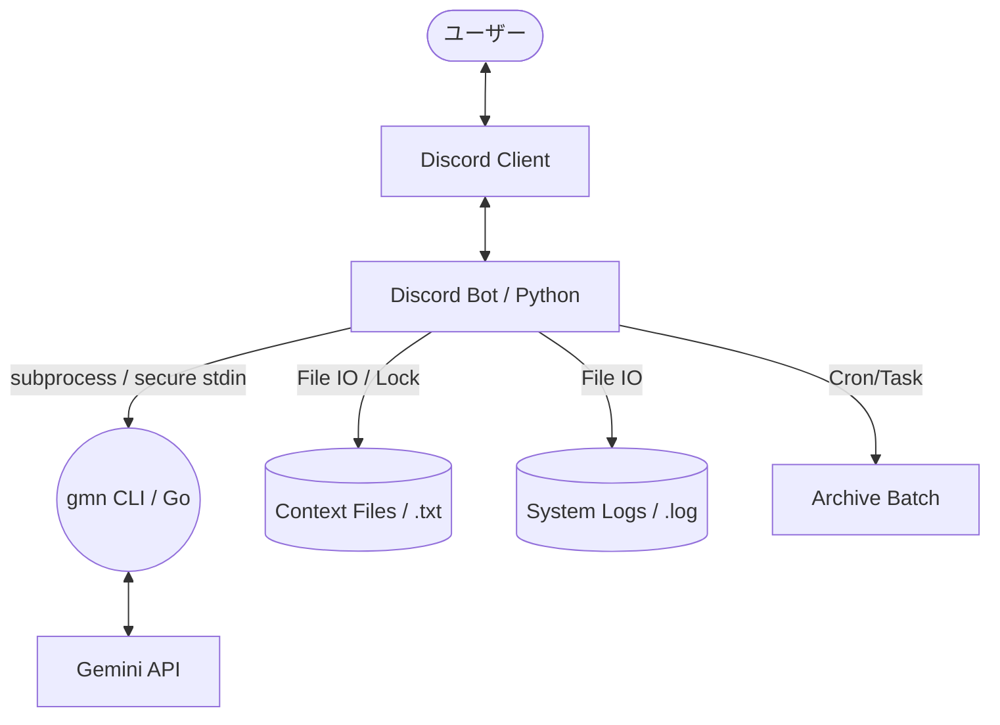

## 1. 概要

本プロジェクトは、Go言語製の高速な Gemini CLI ツールである `gmn` をバックエンドとして活用し、Discord上で高度な対話、文脈維持、およびシステム管理を可能にする Bot `gmnd` を構築するものである。

## 2. アーキテクチャ図



## 3. 主要機能

### 3.1 対話機能

- **常駐チャンネル対応**: 指定した特定のチャンネルでの発言すべてに反応。
    
- **メンション対応**: どのチャンネルでも Bot へのメンション（@Bot）があれば応答。
    
- **高速レスポンス**: `gmn` の軽量性を活かし、プロセス起動のオーバーヘッドを最小化。

- **マルチモーダル対応**: 画像、PDF、テキストファイルなどの添付ファイルを検知し、`gmn` の入力として処理可能。

- **入力中ステータス (Typing...)**: AI の応答生成中に Discord 上で「入力中」を表示し、UX を向上。
    

### 3.2 コンテキスト（履歴）管理システム

トークン制限と精度のバランスを取るため、2層構造の履歴管理を行う。

|**種類**|**保存ファイル**|**内容**|**解像度**|
|---|---|---|---|
|**当日分**|`current_[id].txt`|その日の全やり取り（生ログ）|高（詳細）|
|**過去分**|`archive_[id].txt`|過去の会話を日付別に要約したもの|低（トピック）|
|**システム**|`system_[id].txt`|Botの人格や振る舞いの定義|固定|

- **[id] の定義**: 基本的に **Channel ID** 単位で管理する。
    - パス構造: `data/[guild_id]/[channel_id]/current.txt` のように分離。
- **保存フォーマット**: AI が発話者を識別できるよう、以下の形式で構造化して追記する。
    - `[YYYY-MM-DD HH:MM:SS] [UserDisplayName]: [MessageContent]`
- **同時実効制御**: 複数のメッセージが同時に届いた際、ファイルの破損を防ぐため `Fcntl` 等によるファイル共有ロック（排他制御）を実装する。
- **肥大化防止**: `archive.txt` が一定サイズ（例: 50KB）を超えた場合、ローテーションを行う。

#### 3.2.1 定時バッチ処理 (DAILY_MAINTENANCE)

- **実行タイミング**: 毎日 AM 03:00 (JST)
- **実行主体**: Bot 内のバックグラウンドタスク (`discord.ext.tasks`)
- **処理フロー**:
    1. **対象確認**: 各チャンネルの `current.txt` をスキャンし、内容がある場合のみ処理。
    2. **一時バックアップ**: `current.txt` を `current.bak` にコピー（障害復旧用）。
    3. **要約の生成**: `gmn` を以下の専用プロンプトで呼び出し。
        - *「以下の会話ログから、重要な決定事項、共有された情報、および翌日以降も保持すべき文脈を日付付きで簡潔に要約してください。形式：[YYYY-MM-DD] トピック名: 内容」*
    4. **アーカイブ追記**: 生成された要約を `archive.txt` の末尾に追記。
    5. **クリーンアップ**: `current.txt` を空にする。
- **異常系の対応**:
    - 要約処理が失敗（gmnエラー等）した場合、`current.txt` は削除せず `system.log` にエラーを記録。
    - 管理者にバッチ失敗の通知を送信。
    

### 3.3 コマンド仕様（Slash Commands）

|**コマンド**|**引数**|**説明**|**権限**|
|---|---|---|---|
|`/status`|なし|`gmn` の生存確認、コンテキスト量の表示。|一般|
|`/config`|`key`, `value`|常駐チャンネル等の動作設定を変更。|管理者|
|`/set_system`|`prompt`|システムプロンプト（人格設定）を更新。|管理者|
|`/clear_context`|`scope`|当日分、またはすべて (all) の履歴を消去。|管理者|
|`/model`|`name`|使用する Gemini モデルを切り替え。|一般|
|`/help`|なし|機能一覧と使い方の表示|一般|

- **権限管理**: 管理者権限が必要なコマンドは、Discord の `Administrator` 権限保持者のみ実行可能とする。
- **インタラクティブUI**: `/clear_context` などの破壊的な操作については、実行前に **「本当に消去しますか？」という確認ボタン (Discord Buttons)** を表示し、再確認を求める仕様とする。

|`/help`|なし|機能一覧と使い方の表示|一般|

### 3.4 `gmn` (Gemini CLI) の詳細

本 Bot が使用する `gmn` は、Go 言語で書かれた非対話型・高速な Gemini CLI ツールである。
- **特徴**: 起動速度が非常に高速（~23ms）であり、シェルスクリプトやプログラムからの呼び出しに最適化されている。
- **データ供給**: `-f` フラグにより、正規の Gemini CLI に準拠したシステム指示や複数の文脈ファイルを読み込み可能。
- **認証**: 独自の認証コマンドは持たず、公式 `gemini-cli` が `~/.gemini/` に保存するキャッシュトークンを再利用する。
- **マルチモーダル**: 画像や PDF などのファイルも `-f` フラグで渡すことが可能。

## 4. `gmn` 呼び出し仕様

セキュリティ（コマンドインジェクション防止）のため、外部プロセス呼び出し時にユーザー入力をシェル引数として直接渡さない。

**推奨される実装パターン (Python):**

```python
import subprocess

# 安全な引数の組み立て
# gmn [prompt] -f file1 -f file2 ...
args = ["gmn", "-f", "system.txt", "-f", "archive.txt", "-f", "current.txt"]
# prompt を positional argument として渡すか、stdin 経由で渡す
result = subprocess.run(args, input=user_text, text=True, capture_output=True)
```

- **エラーハンドリング**: `gmn` の終了コードが非0の場合、Discordにエラーメッセージを返す。
- **レート制限 (Rate Limiting)**: 
    - Gemini API の無料枠制限（15 RPM等）に抵触した場合、429 エラーを検知し、ユーザーに「現在リクエストが集中しています。しばらくお待ちください」と通知し、指数バックオフによるリトライを行う。
- **レスポンス分割**: Discordの2000文字制限を超える応答は、適切に分割して連続送信する。

## 5. 運用上の要件

- **認証**: `gemini-cli (Node.js版)` で一度 `gemini login` を済ませ、`~/.gemini/` に認証情報が存在すること。

- **機密情報管理 (`.env`)**:
    - `DISCORD_BOT_TOKEN`: Discord Bot のトークン。

- **動作設定 (`config.json`)**:
    - `resident_channel_id`: Bot が常駐し、メンションなしで反応するチャンネル。
    - `allowed_channel_ids`: 反応を許可するチャンネルのリスト。
    - `default_model`: 標準使用モデル (`gemini-1.5-flash` など)。

- **環境要件**:
    - **Python 3.10+** (`discord.py 2.0+`, `python-dotenv`)
    - **Go 1.20+** (`gmn` バイナリのビルド・実行用)
    - **Discord Gateway Intents**:
        - `Message Content Intent` (必須: AIがメッセージを読むため)
        - `Guilds` / `Guild Messages` (サーバー情報の取得)
    - **デプロイ形式**: 
        - 開発・本番環境の差異をなくすため、**Multi-stage Build を用いた Dockerfile** の提供を推奨する（Python と Go の両ランタイムを包含）。

- **ロギング**:
    - 会話内容とは別に、`system.log` にエラー、起動/終了イベント、認証エラーなどを記録する。
    - ログ出力レベル（INFO/ERROR/DEBUG）を適切に使い分ける。

- **終了処理 (Graceful Shutdown)**:
    - `SIGTERM` 等のシグナルを検知した際、未書き込みのバッファをフラッシュしてから安全にプロセスを終了する。
        

---

### Next Step

- **完全なソースコードの作成**: この仕様に基づいた Python スクリプトのプロトタイプを書き出します。
    
- **環境構築手順の作成**: `gmn` のインストールから Discord Developer Portal の設定までをガイドします。
    
- **要約用プロンプトの調整**: AM3:00のバッチ処理で使う「精度の高い要約プロンプト」を考案します。